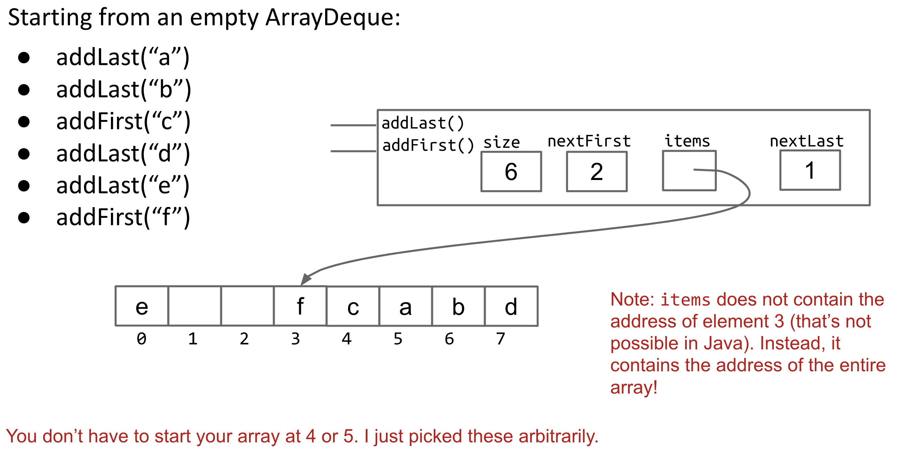

#CS61B proj1a

## 1. LinkedListDeque

use sentfront and sentback

## 2. ArrayDeque

Use nextfirst and next last

when creating an empty deque: set nextlast to 0, nextfirst to the end of the array

when resizing the duque: set nextfirst to the end of the array, copy the element one by one from 0, and then set nextlast to the corresponding place after all elements have been set.

